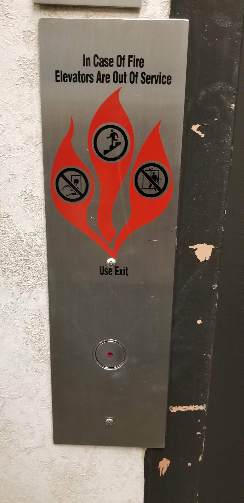
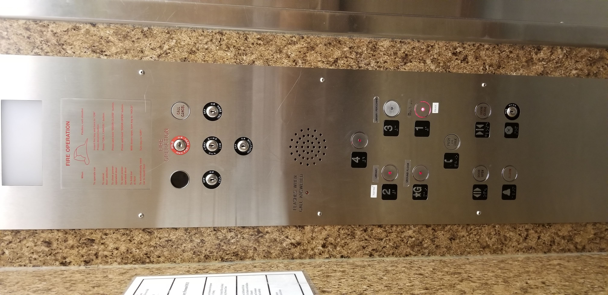

# Report for hw1

Links:

[Presentation Page](https://jgarc935.github.io/hw1/)

[GitHub repository](https://github.com/jgarc935/hw1)

[Demo](https://jgarc935.github.io/hw1/demo.html)

[Video](youtube.com)

<h2>Part C:</h2>

This elevator is located at the El Paso Community College  Building A.

Issues/Bad Design:
1) The layout of the buttons does not depict the layout of the building.
2) The labels are hard to read and the 4th floor is even missing a label.
3) The G button is considered the 1st floor.
4) You cannot cancel the request by pressing the button.

<h2>Part B:</h2>

The most common uses for an elevator are to select a floor and to open/close the door. The most uncommon feature is pressing the Alarm/Emergency button.

The user(s) will enter the elvator and select a floor(s). Will press the Open button to hold the door for other individuals or press the Close button to speed up the process.

The elevator provides feedback by lighting up once a button is pressed and by displaying the current floor at the top.

A common mistke to make with this design is deciding whether the 1st floor is the 1st floor or if the ground floor is the basement.

%%%Add image of sketch

Part A:
The screen size for my design would 18 inches high and 8 inches wide.

%%%Add image of gif
